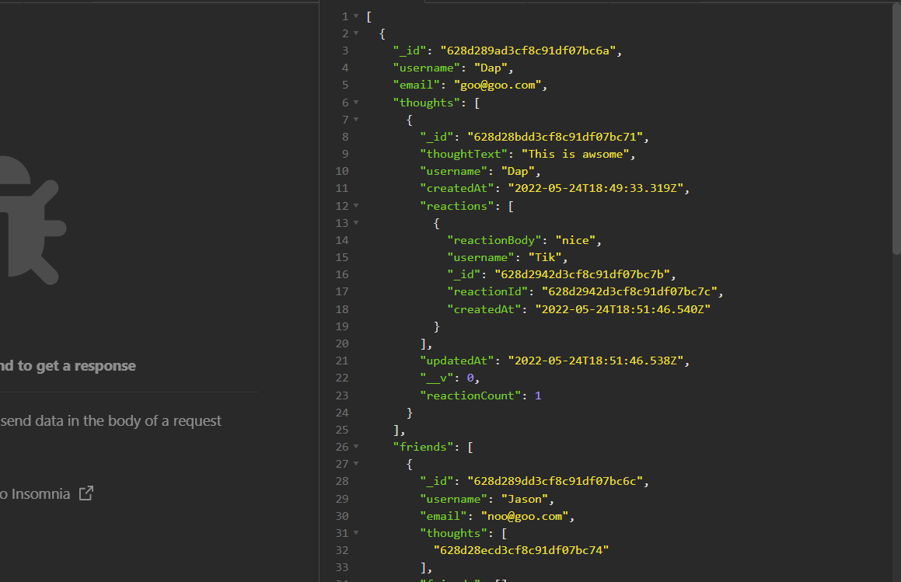
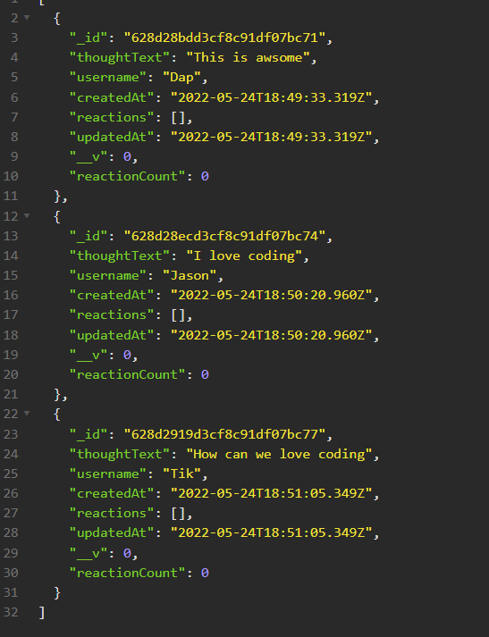
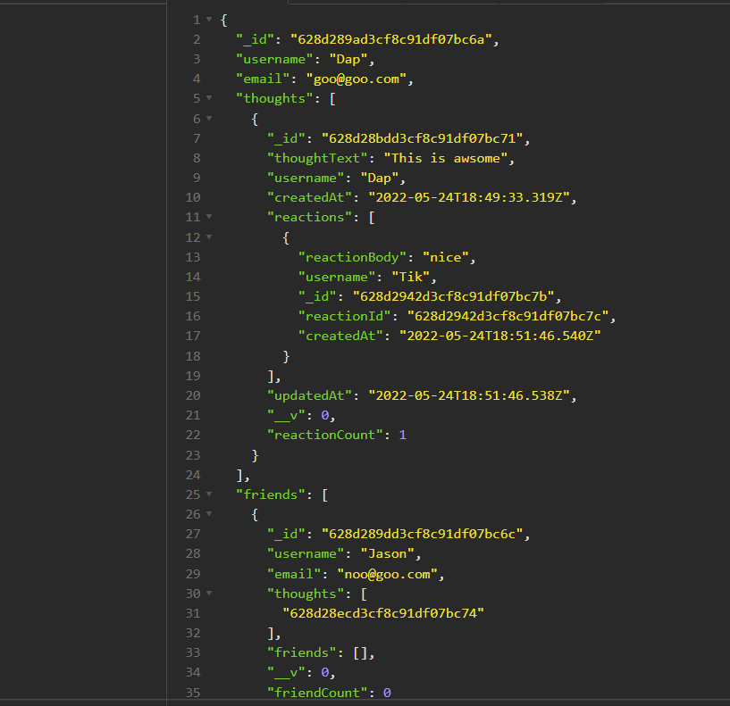

# Social Network API 

    
    This project API is the base backend structure for most for Social Network applications.User will be able to create your own thoughts and user friend can react to your thoughts

## Table Contents

  - [Installation](#installation)
  - [Usage](#usage)
  - [Contributing](#contributing)
  - [Test](#test)
  - [Question](#question)

## Installation
    Clone this repository
    npm i

## Usage
    JavaScript
    Node.js
    Express
    Mongodb
    Mongoose

   

## Contributing
    Anyone who want to make this app better please contact me below

## Demo

Demo link: [https://drive.google.com/file/d/1qlJ8w0TzwyAbUFb01pvIOsyFIvrOJAn7/view](https://drive.google.com/file/d/1qlJ8w0TzwyAbUFb01pvIOsyFIvrOJAn7/view)

## Question
- [https://github.com/phacharapol18](https://github.com/phacharapol18)
- <a href = "mailto:phacharapol18@gmail.com" target = "_blank">phacharapol18@gmail.com</a>
### Thank you
    